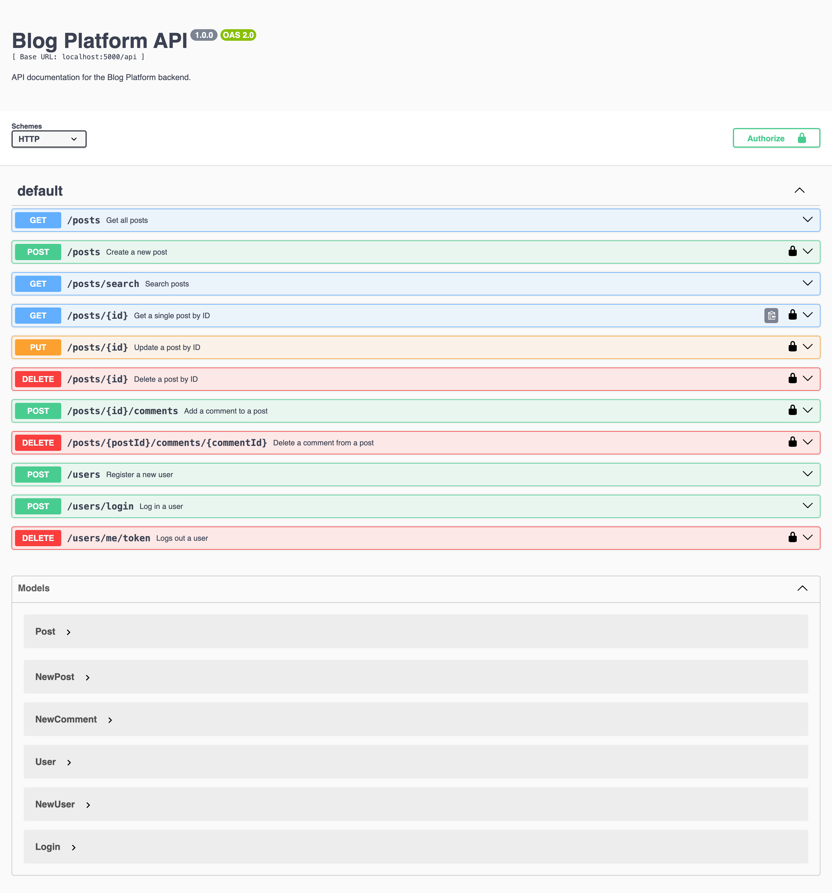

# Blog API Platform

## Overview
The Blog API Platform is a RESTful API designed for managing blog posts, comments, and users. It allows users to create, read, update, and delete blog posts and comments, providing a flexible and scalable solution for blogging applications.

## Project Structure:

    src/
    ├── config
    │   ├── config.js             # General configuration settings
    │   ├── db.js                 # Database connection setup
    │   ├── swagger.js            # Swagger documentation configuration
    ├── controllers
    │   ├── postController.js     # Business logic for posts
    │   ├── userController.js     # Business logic for users
    ├── middlewares
    │   ├── requireAuth.js        # Middleware for authentication
    │   ├── requireAdmin.js       # Middleware for admin authorization
    ├── models
    │   ├── Post.js               # Mongoose schema and model for posts
    │   ├── User.js               # Mongoose schema and model for users
    ├── routes
    │   ├── postRoutes.js         # Routes for post-related operations
    │   ├── userRoutes.js         # Routes for user-related operations
    ├── tests
    │   ├── post.test.js          # Tests for post-related operations
    │   ├── setupTests.js         # setup for test
    │   ├── user.test.js          # Tests for user-related operations
    ├── .env                      # Environment variables file
    ├── app.js                    # Entry point for the application
    ├── package.json              # Project dependencies and scripts
    └── README.md                 # Project documentation (this file)
    └── ...


## Features
- **User Authentication**: Secure user registration and login with JSON Web Tokens (JWT).
- **Post Management**: Create, read, update, and delete blog posts.
- **Comment Management**: Add, read, and delete comments on blog posts.
- **Unique Email Validation**: Ensure user emails are unique to avoid duplicates.
- **Robust Error Handling**: Comprehensive error messages for different scenarios.
- **Environment Configuration**: Configurable environment settings using `.env` files.

## Technologies Used
- **Node.js**: JavaScript runtime for building the API.
- **Express**: Web framework for building the API server.
- **MongoDB**: NoSQL database for data storage.
- **Mongoose**: ODM library for MongoDB and Node.js.
- **JWT**: Token-based authentication.
- **Jest**: Testing framework for unit and integration testing.
- **Supertest**: HTTP assertion library for testing API endpoints.

## Getting Started
### Prerequisites
- Node.js (version 14 or higher)
- MongoDB (either locally or via a cloud provider)

### Installation
1. Clone the repository:
   ```
   git clone https://github.com/your-username/blog-api-platform.git
   cd blog-api-platform
   ```
2. Install Dependencies:
    ```
       npm install
    ```
3. Create your own env from .env.example
    ```
      cp .env.example .env
    ```
4. Run application:
    ```
      npm run dev
    ```


### Documentation can be found at:

```{PORT}/api-docs/```

### Screenshot of Swagger Documentation


